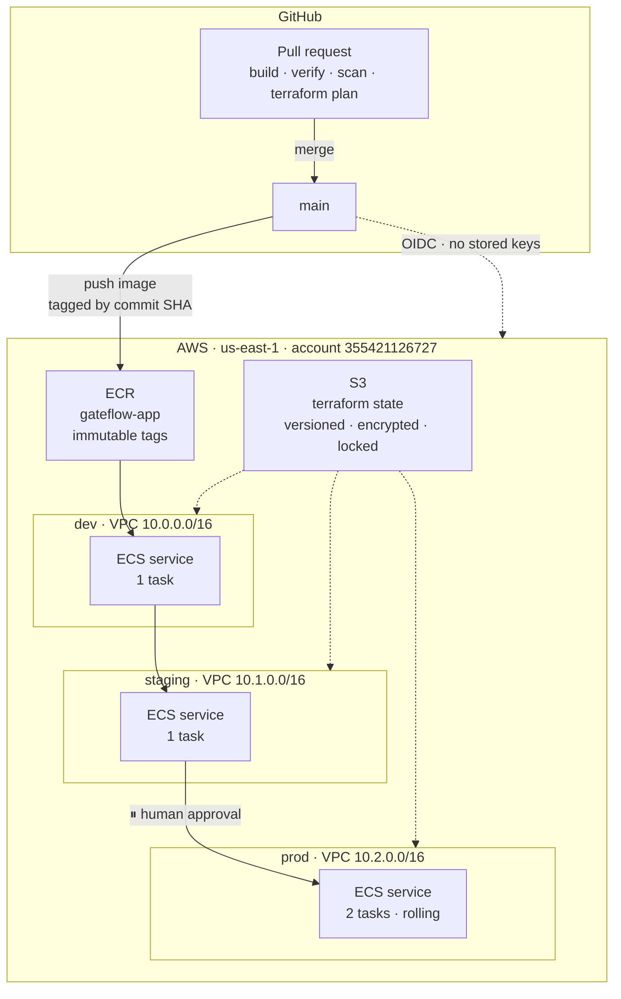
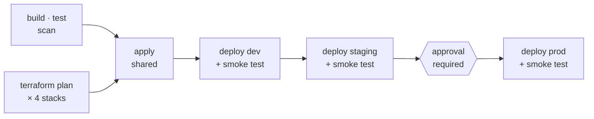

# GateFlow

A multi-environment CI/CD delivery pipeline on AWS. A commit to `main` is
built, scanned, published, and promoted through **dev → staging → production**
with no human running a deployment command — but production is reached only
after a human approves it.

The application is deliberately trivial. **The pipeline is the engineering.**

---

## Architecture



Each environment is an independent Terraform stack with **its own state file**,
so a `terraform destroy` in one cannot see another's resources.

## The pipeline



| Event | What runs |
|---|---|
| **Pull request** | build, run and test the container, assert it is not root, Trivy scan, `terraform plan` for all four stacks. **Nothing is applied.** |
| **Merge to `main`** | publish the image to ECR, apply infrastructure, deploy dev → staging → *pause* → production |

Each stage proceeds only if the previous stage's smoke test passed.

---

## What this demonstrates

**No long-lived cloud credentials.** The pipeline authenticates to AWS via
OpenID Connect, exchanging a short-lived GitHub identity token for temporary
STS credentials. There is no `AWS_ACCESS_KEY_ID` stored anywhere. The trust
policy is scoped to immutable repository and owner IDs, so it survives a
rename and cannot be assumed by forks.

**The pipeline cannot escalate its own permissions.** The state bucket, the
OIDC provider and the CI role live in a `bootstrap` stack applied by a human,
never by CI. If the pipeline's own Terraform owned the role the pipeline
assumes, anyone able to merge could grant that role more access.

**One artifact, promoted — never rebuilt.** A single image digest flows
through all three environments. Configuration is injected at runtime from each
environment's task definition, so the same bytes report `dev`, `staging` and
`prod` respectively. Rebuilding per environment would mean testing one
artifact and shipping a different one.

**Immutable image tags.** Every image is tagged with the commit SHA that
produced it, never `latest`. You can always answer "which commit is in
production", and rollback has a real target.

**The approval gate is configuration, not code.** It is a required-reviewer
rule on the `prod` GitHub Environment — not a condition in the workflow file.
Someone with write access cannot remove the gate by editing the pipeline. This
is the *Vier-Augen-Prinzip* applied structurally.

**Deployment is verified, not assumed.** "The orchestrator is satisfied" and
"the application is reachable" are different claims. Each deploy waits for the
ECS service to reach steady state, then calls the running app from outside and
asserts the response contains the expected environment label.

**Containers run unprivileged, and it is tested.** The image is a multi-stage
build (46 MB final, versus ~200 MB single-stage) running as a non-root user —
enforced by a CI assertion that fails the build if the container resolves to
UID 0.

---

## Repository layout

```
app/                      Flask application + multi-stage Dockerfile
terraform/
  bootstrap/              human-applied once: state bucket, OIDC, CI role
  shared/                 ECR — one registry for all environments
  modules/network/        VPC, subnets, IGW, routing, security group
  modules/ecs-service/    cluster, EC2 capacity, task definition, service
  environments/{dev,staging,prod}/   one stack and one state file each
.github/workflows/
  ci.yml                  the gate and the promotion chain
  deploy.yml              reusable deployment, called once per environment
docs/
  knowledge-transfer.md   plain-language build narrative + interview prep
  architecture.md         design decisions and reasoning
  evidence/               proof the system ran
tests/                    unit + integration tests
```

## Environments

| | dev | staging | production |
|---|---|---|---|
| VPC | 10.0.0.0/16 | 10.1.0.0/16 | 10.2.0.0/16 |
| instances / tasks | 1 / 1 | 1 / 1 | **2 / 2** |
| deployment | stop-then-start | stop-then-start | **rolling, 50% min healthy** |
| log retention | 3 days | 7 days | 30 days |
| deploys | automatically | automatically | **after approval** |

Only production deploys without downtime. Elsewhere the container binds a
fixed host port on a single instance, so the old task must stop before the new
one can start. That is a consequence of port binding, not a limitation of the
orchestrator.

---

## Deliberate trade-offs

Two choices here are **not** production-correct. They are cost decisions on a
free-tier account, documented rather than hidden.

| Choice | Saved | Cost in realism |
|---|---|---|
| Public subnets, **no NAT Gateway** | ~$33/mo | Real workloads use private subnets and egress through NAT. These instances are directly internet-reachable, protected only by security-group rules. |
| **No load balancer** | ~$16/mo | No TLS, no stable DNS, no path routing — and no zero-downtime deployment outside production. |

With a budget: a load balancer with dynamic host ports for zero-downtime
deployments everywhere, private subnets, and separate AWS accounts per
environment rather than separate state files.

## Verified

Three environments, one image digest — see
[`docs/evidence/`](docs/evidence/) for the full capture.

```
dev     → {"message":"Hello from GateFlow","version":"dev"}
staging → {"message":"Hello from GateFlow","version":"staging"}
prod    → {"message":"Hello from GateFlow","version":"prod"}
```

The application's own fallback value is `v1`. None of the three responses say
`v1`, which proves the value reached the container from its task definition
rather than being baked into the image.

---

## Status

**Phase 1 complete** — Terraform, ECS on EC2, three environments, approval gate.

| | |
|---|---|
| ✅ | Container build, hardening, and CI verification |
| ✅ | Remote state, keyless CI authentication, image registry |
| ✅ | Network and runtime modules, reused across three environments |
| ✅ | Promotion pipeline with a required-reviewer gate on production |
| ✅ | Smoke tests gating each promotion |
| 🔲 | Unit tests |
| 🔲 | Automatic rollback on post-deployment smoke-test failure |
| 🔲 | Metrics and dashboards (Prometheus / Grafana) |
| 🔲 | Narrow the CI role from broad to least-privilege |
| 🔲 | **Phase 2** — migrate the same application and pipeline to Kubernetes |

New to the project? Start with
[`docs/knowledge-transfer.md`](docs/knowledge-transfer.md) — the whole system
explained in plain language, no code.
test

